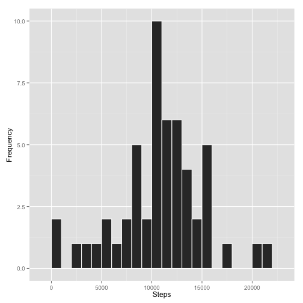
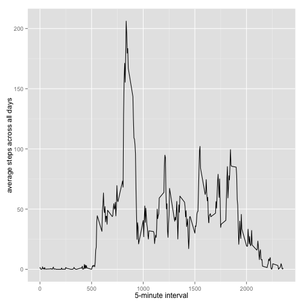
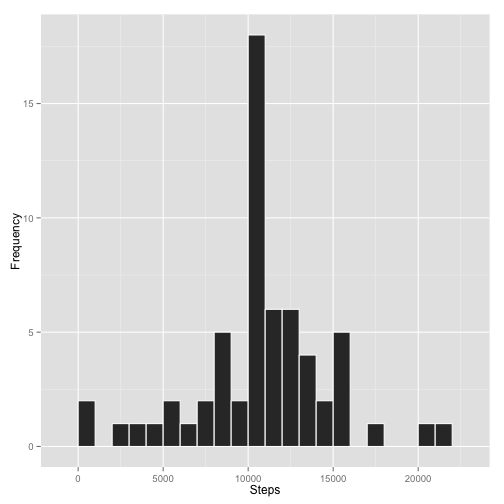
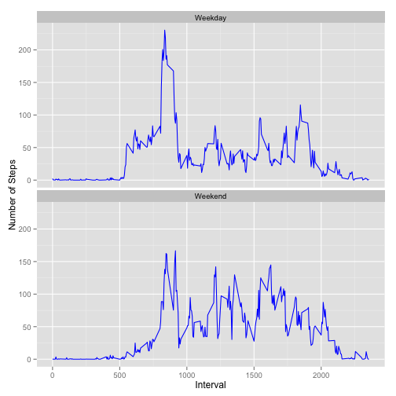

# Reproducible Research: Peer Assessment 1


## Loading and preprocessing the data

```r
require("ggplot2")
```

```
## Loading required package: ggplot2
```

```r
require("plyr")
```

```
## Loading required package: plyr
```

```r
source('daysandends.R')
source('fillin.R')  

dataset <- read.csv("activity.csv")
```


```r
fillin <- function(data) {
meanint <- ddply(data, .(interval), summarize, steps = mean(steps, na.rm =T))
  for (i in 1:17568) {
    if (i %% 288 == 0){
      j = 288
    } else {
      j = i %% 288
    }
    if (is.na(data$steps[i])){
      data$steps[i] <- meanint$steps[j]
    }
  }
  data
}
```


```r
daysandends <- function(date) {
  day <- weekdays(as.Date(date))
  if (day %in% c("Saturday", "Sunday")) {
    result <- "Weekend"
  } else {
    result <- "Weekday"
  }
  result
}
```

## What is mean total number of steps taken per day?
1. Make a histogram of the total number of steps taken each day

  
  ```r
  good <- complete.cases(dataset)
  data.comp <- dataset[good,]
  data.comp.sum <- ddply(data.comp, .(date), summarize, sum.steps = sum(steps))  ## Calculating the sum steps taken per day  
  
  his <- ggplot(data.comp.sum, aes(sum.steps))
  his + geom_histogram(colour = "white", binwidth = 1000) + ylab("Frequency") + xlab("Steps")
  ```
  
   

2. Calculate and report the mean and median total number of steps taken per day
  
  ```r
  mean(data.comp.sum$sum.steps) ## Mean of the total number of steps taken per day
  ```
  
  ```
  ## [1] 10766
  ```
  
  ```r
  median(data.comp.sum$sum.steps) ## Median of total number of steps taken per day
  ```
  
  ```
  ## [1] 10765
  ```


## What is the average daily activity pattern?
1. Make a time series plot (i.e. type = "l") of the 5-minute interval (x-axis) and the average number of steps taken, averaged across all days (y-axis)
  
  ```r
  data.comp.q3 <- ddply(data.comp, .(interval), summarize, mean.steps = mean(steps))
  q3 <- ggplot(data.comp.q3, aes(x = interval, y = mean.steps))
  q3 + geom_line() + xlab("5-minute interval") + ylab("average steps across all days")
  ```
  
   

2. Which 5-minute interval, on average across all the days in the dataset, contains the maximum number of steps?
  
  ```r
  data.comp.q3[data.comp.q3$mean.steps == max(data.comp.q3$mean.steps),]
  ```
  
  ```
  ##     interval mean.steps
  ## 104      835      206.2
  ```

## Imputing missing values
1. Calculate and report the total number of missing values in the dataset (i.e. the total number of rows with NAs)
  
  ```r
  sum(is.na(dataset))
  ```
  
  ```
  ## [1] 2304
  ```

2. Devise a strategy for filling in all of the missing values in the dataset. The strategy does not need to be sophisticated. For example, you could use the mean/median for that day, or the mean for that 5-minute interval, etc.

  `I will substitute the NA by the mean of 5 minute interval.`

3. reate a new dataset that is equal to the original dataset but with the missing data filled in.
  
  ```r
  data.fill <- fillin(dataset)
  ```

4. Make a histogram of the total number of steps taken each day and Calculate and report the mean and median total number of steps taken per day. 
  
  ```r
  data.fill.sum <- ddply(data.fill, .(date), summarize, sum.steps = sum(steps))
  his.fill <- ggplot(data.fill.sum, aes(sum.steps))
  his.fill + geom_histogram(colour = "white", binwidth = 1000) + ylab("Frequency") + xlab("Steps")
  ```
  
   

  Do these values differ from the estimates from the first part of the assignment? What is the impact of imputing missing data on the estimates of the total daily number of steps?
  
  ```r
  mean(data.fill.sum$sum.steps)
  ```
  
  ```
  ## [1] 10766
  ```
  
  ```r
  median(data.fill.sum$sum.steps)
  ```
  
  ```
  ## [1] 10766
  ```

  `The median of estimated data does not differ from the raw data so much, while the mean is the same as the raw data.`

## Are there differences in activity patterns between weekdays and weekends?
1. Create a new factor variable in the dataset with two levels -- "weekday" and "weekend" indicating whether a given date is a weekday or weekend day.
  
  ```r
  data.fill.q5 <- ddply(data.fill, .(date, interval, steps), summarize, day = daysandends(date))
  ```

2. Make a panel plot containing a time series plot (i.e. type = "l") of the 5-minute interval (x-axis) and the average number of steps taken, averaged across all weekday days or weekend days (y-axis). 
  
  ```r
  data.fill.q5.1 <- ddply(data.fill.q5, .(day, interval), summarize, average.steps = mean(steps))
  q5 <- ggplot(data.fill.q5.1, aes(x = interval, y = average.steps))
  q5 + geom_line(colour = "blue") + facet_wrap(~ day, nrow = 2, ncol = 1) + xlab('Interval') + ylab('Number of Steps')
  ```
  
   
